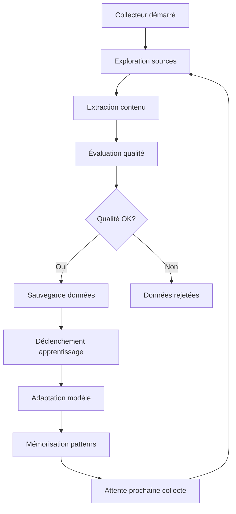

# 🌐 Collecteur Intelligent de Données

## 🎯 Vision
*"Comme un parent digital qui va chercher les meilleures ressources pour faire grandir son enfant IA"*

Le Collecteur Intelligent explore automatiquement internet pour trouver des données de qualité et nourrir l'apprentissage de votre IA. Il fonctionne 24h/24, s'adapte aux patterns découverts, et améliore continuellement la qualité des données collectées.

## 🧠 Intelligence Adaptative

### 🔍 Exploration Automatique
- **Sources Multiples** : Reddit, ArXiv, Wikipedia, GitHub, HuggingFace
- **Détection de Qualité** : Algorithmes de scoring automatique
- **Apprentissage des Préférences** : Adaptation selon les succès passés
- **Évitement des Doublons** : Système de déduplication intelligent

### 📊 Types de Données Collectées

#### 💬 Conversations (Reddit, Forums)
```json
{
  "question": "Comment fonctionne l'apprentissage automatique ?",
  "answer": "L'apprentissage automatique utilise des algorithmes...",
  "context": "Discussion sur r/MachineLearning",
  "quality_score": 0.87
}
```

#### 📚 Instructions Académiques (ArXiv)
```json
{
  "instruction": "Explique l'article: 'Attention Is All You Need'",
  "response": "Ce papier introduit l'architecture Transformer...",
  "source": "ArXiv:1706.03762",
  "quality_score": 0.94
}
```

#### 💻 Code (GitHub)
```json
{
  "task": "Implémente un réseau de neurones en Python",
  "code": "import torch\nclass NeuralNetwork(nn.Module)...",
  "repository": "pytorch/examples",
  "quality_score": 0.82
}
```

#### 📖 Connaissances (Wikipedia)
```json
{
  "question": "Qu'est-ce que l'intelligence artificielle ?",
  "answer": "L'intelligence artificielle est une technologie...",
  "source": "Wikipedia:Artificial_intelligence",
  "quality_score": 0.89
}
```

## 🚀 Démarrage Rapide

### 1. Configuration Automatique
```bash
# Configuration complète en une commande
python smart_setup.py

# Configuration rapide
python smart_setup.py --quick

# Tests uniquement
python smart_setup.py --test-only
```

### 2. Lancement du Collecteur
```bash
# Démarrage intelligent avec redémarrage automatique
./start_smart_collector.sh

# Collecte spécialisée par domaine
python autonomous_collector.py --domain ai
python autonomous_collector.py --domain code
python autonomous_collector.py --domain science

# Test de collecte unique
python autonomous_collector.py --test
```

### 3. Surveillance et Monitoring
```bash
# Dashboard web interactif
./start_dashboard.sh
# → Ouvre http://localhost:8501

# Monitoring en terminal
./monitor_smart.sh

# Statistiques rapides
python monitor_collector.py
```

## 📡 Sources de Données

### 🤖 Intelligence Artificielle
- **Reddit** : r/MachineLearning, r/artificial, r/deeplearning
- **ArXiv** : cs.AI, cs.LG, cs.CL (derniers articles)
- **GitHub** : Repos populaires en ML/AI
- **Papers** : Résumés et explications vulgarisées

### 💻 Programmation
- **GitHub** : Exemples de code, tutoriels
- **StackOverflow** : Q&A techniques
- **Reddit** : r/programming, r/Python
- **Documentation** : Guides et best practices

### 🔬 Recherche Scientifique
- **ArXiv** : Prépublications scientifiques
- **Wikipedia** : Articles encyclopédiques
- **Nature AI** : Articles de recherche
- **Publications** : Résumés de recherche

### 📚 Données Curatées
- **HuggingFace Datasets** : Datasets de qualité
- **Common Crawl** : Textes web filtrés
- **OpenAI Datasets** : Données publiques

## ⚙️ Configuration Avancée

### 🎛️ Paramètres Principaux
```bash
python autonomous_collector.py \
  --collection-interval 4 \      # Collecte toutes les 4h
  --learning-interval 8 \        # Apprentissage toutes les 8h
  --domain ai                    # Spécialisation IA
```

### 📋 Fichier de Configuration
`config/collector_config.json` :
```json
{
  "collection_settings": {
    "default_interval_hours": 6,
    "max_items_per_source": 100,
    "quality_threshold": 0.6
  },
  "data_sources": {
    "reddit": {"enabled": true, "subreddits": ["MachineLearning"]},
    "arxiv": {"enabled": true, "categories": ["cs.AI"]},
    "wikipedia": {"enabled": true},
    "github": {"enabled": true},
    "huggingface": {"enabled": true}
  }
}
```

## 📊 Système de Qualité

### 🎯 Scoring Automatique
Le collecteur évalue automatiquement la qualité des données :

- **Longueur appropriée** (50-2000 caractères)
- **Contenu substantiel** (pas de spam)
- **Cohérence** (structure logique)
- **Popularité** (upvotes, étoiles GitHub)
- **Fraîcheur** (contenu récent privilégié)

### 📈 Amélioration Continue
- **Apprentissage des préférences** utilisateur
- **Adaptation des sources** selon la performance
- **Optimisation automatique** des paramètres
- **Feedback loop** sur la qualité des résultats

## 🔄 Workflow Automatique



## 📈 Monitoring et Statistiques

### 🖥️ Dashboard Web
Interface graphique complète :
- **Métriques en temps réel**
- **Graphiques de progression**
- **Qualité par source**
- **Contrôles interactifs**

### 📊 Statistiques Terminal
```bash
📊 === STATISTIQUES DE COLLECTE ===
🌐 Sources actives: 5/6
📈 Total d'éléments: 2,847
🧠 Patterns appris: 156
⚡ Taux de réussite: 87.3%
```

### 📜 Logs Détaillés
- `logs/data_collector.log` : Collecte détaillée
- `logs/adaptive_learning.log` : Apprentissage
- `logs/quality_assessment.log` : Évaluation qualité

## 🛠️ Personnalisation

### ➕ Ajouter une Source
```python
from src.data_collector import DataSource

# Nouvelle source personnalisée
custom_source = DataSource(
    name="MonSite",
    url="https://monsite.com/api",
    data_type="qa",
    extraction_method="api",
    update_frequency=12,
    max_items=50
)

collector.add_custom_source(custom_source)
```

### 🎯 Domaines Spécialisés
```bash
# IA et Machine Learning
python autonomous_collector.py --domain ai

# Programmation et développement
python autonomous_collector.py --domain code

# Recherche scientifique
python autonomous_collector.py --domain science
```

## 🔐 Sécurité et Éthique

### ✅ Respect des Robots.txt
- Vérification automatique des autorisations
- Respect des limites de taux
- Délais entre requêtes

### 🛡️ Filtrage de Contenu
- Détection de contenu inapproprié
- Filtrage automatique du spam
- Validation de la qualité

### 📊 Transparence
- Traçabilité complète des sources
- Métadonnées détaillées
- Logs d'audit complets

## 🚨 Dépannage

### ❌ Problèmes Courants

**Pas de données collectées :**
```bash
# Vérifier la connectivité
python autonomous_collector.py --test

# Vérifier les logs
tail -f logs/data_collector.log
```

**Erreurs d'apprentissage :**
```bash
# Réinitialiser la mémoire
rm models/adaptive_memory.json

# Redémarrer l'apprentissage
python autonomous_collector.py --learning-interval 1
```

**Performance lente :**
```bash
# Réduire le nombre d'éléments par source
# Modifier config/collector_config.json
"max_items_per_source": 50
```

## 📞 Support

### 🆘 Obtenir de l'Aide
```bash
# Aide intégrée
python autonomous_collector.py --help

# Diagnostics automatiques
python smart_setup.py --test-only

# Statistiques détaillées
python monitor_collector.py
```

### 📖 Documentation
- `README_ADAPTATIF.md` : Vue d'ensemble
- `docs/` : Documentation détaillée
- `examples/` : Exemples d'utilisation

---

## 🌟 Points Forts

✅ **Complètement autonome** - Fonctionne sans supervision
✅ **Qualité garantie** - Système de scoring intelligent
✅ **Multi-sources** - Diversité des données collectées
✅ **Apprentissage continu** - S'améliore avec le temps
✅ **Interface intuitive** - Dashboard web + monitoring
✅ **Highly customizable** - Configuration flexible
✅ **Éthique** - Respect des règles et droits
✅ **Performance optimisée** - Collecte efficace

*Le Collecteur Intelligent transforme votre IA en système d'apprentissage véritablement autonome, capable de grandir et d'évoluer sans intervention humaine, comme un enfant curieux qui explore le monde pour apprendre.*
